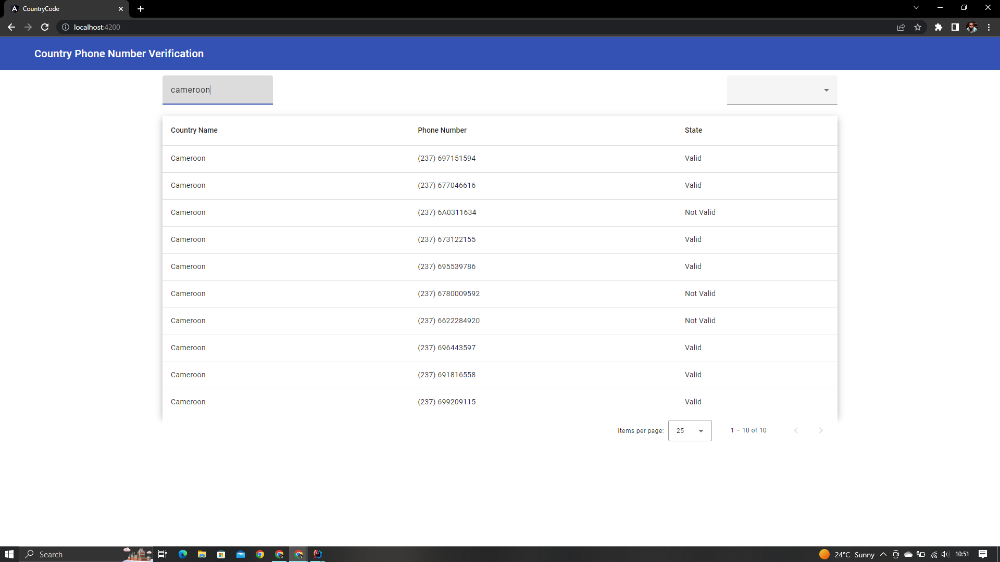

# country-api

An example RESTful API to list and categorize country phone numbers for Spring Boot. Phone numbers are categorized by
country, state (valid or not valid), country code and number.

- applicationUrl: `http://localhost:8080`

## Requirements

* [JDK 11](https://www.oracle.com/java/technologies/javase/jdk11-archive-downloads.html)

> The JAVA_HOME environment variable must be
> set. [see](https://docs.oracle.com/cd/E19182-01/820-7851/inst_cli_jdk_javahome_t/)

## Steps to Setup

**1. Clone the application**

```bash
git clone git@github.com:wanjaeliud/agencify-phone-number-verification.git
```

**2. In the root folder Navigate to CountryCode (Spring boot app) folder and run the following command**

- MacOS / Linux:
    ```bash
    ./mvnw spring-boot:run
    ```

- Windows:
  ```bash
  mvn spring-boot:run
  ```
  The app will start running at `http://localhost:8080/api/countries`

**3. Open a new terminal and navigate to the country-code-frontend and run the following command.**

- Windows:
    ```bash
    npm install or yarn install
    ```
  then run

```bash
ng serve --open
```

this start the angular ap http://localhost:4200/

## screenshots

